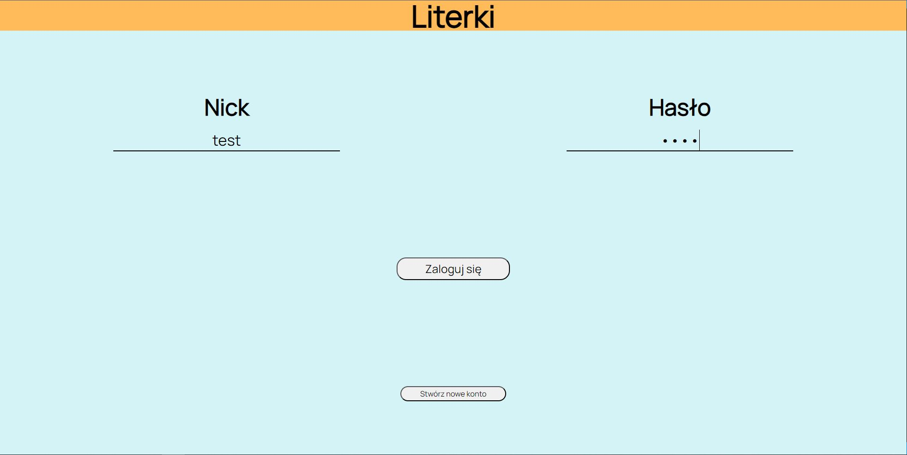
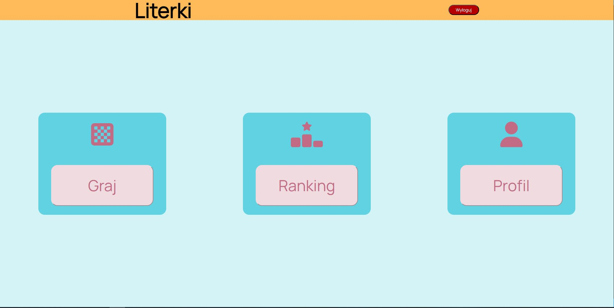
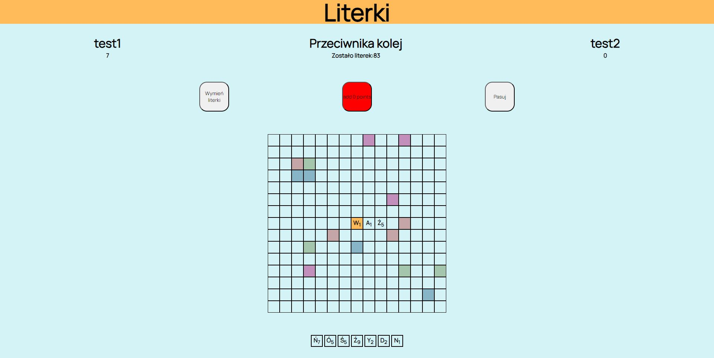
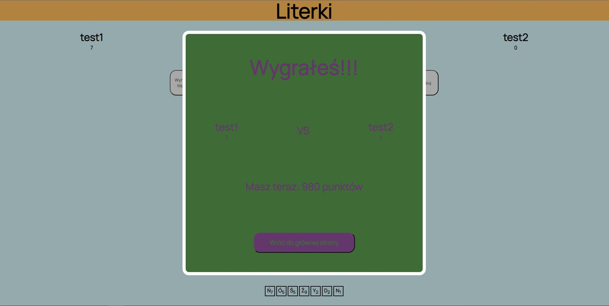
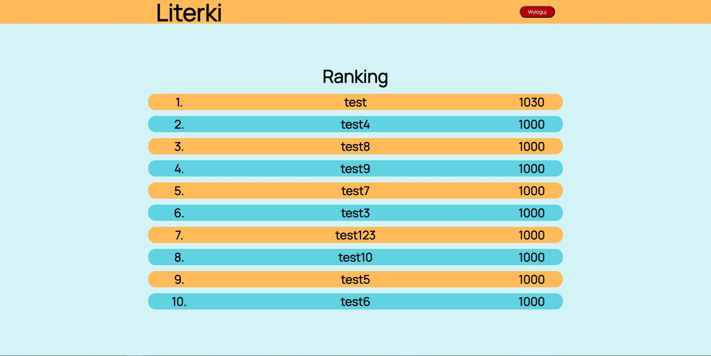

<h1>Literki</h1>
<h2>Project is game for two players where you need to create words from given letters. You need to create account, because if you win you will get points to your ranking but if you lose will also lose your points. Try to be the best player on the server</h2>
<h3>Project was made by using technologies:</h3>
<ul>
  <li>React</li>
  <li>Typescript</li>
  <li>Scss</li>
  <li>Express.js</li>
  <li>Socket.io</li>
</ul>

<h2>Screenshots</h2>

